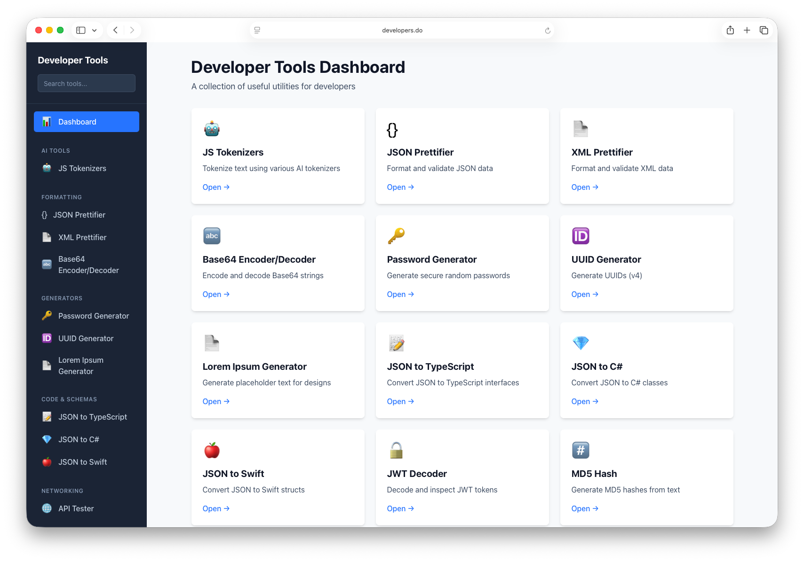

# DevTools

A collection of essential developer tools built with privacy in mind.
No backend. No data collection. Everything runs locally in your browser.



## Tools

### AI Tools
*   **JS Tokenizers:** Tokenize text using various AI tokenizers
*   **Sentiment Analysis:** Analyze emotional tone of text using AI

### Formatting
*   **JSON Prettifier:** Format and validate JSON data
*   **XML Prettifier:** Format and validate XML data
*   **Base64 Encoder/Decoder:** Encode and decode Base64 strings

### Generators
*   **Password Generator:** Generate secure random passwords
*   **UUID Generator:** Generate UUIDs (v4)
*   **Lorem Ipsum Generator:** Generate placeholder text for designs

### Code & Schemas
*   **JSON to TypeScript:** Convert JSON to TypeScript interfaces
*   **JSON to C#:** Convert JSON to C# classes
*   **JSON to Swift:** Convert JSON to Swift structs
*   **JSON to Kotlin:** Convert JSON to Kotlin data classes
*   **JSON to Go:** Convert JSON to Go structs
*   **JSON to Rust:** Convert JSON to Rust structs
*   **Color Picker:** Pick colors and convert between HEX, RGB, HSL, HSV, and CMYK formats

### Security
*   **JWT Decoder:** Decode and inspect JWT tokens
*   **MD5 Hash:** Generate MD5 hashes from text
*   **SHA-1 Hash:** Generate SHA-1 hashes from text

### Networking
*   **API Tester:** Test and view API responses

## View Live

Explore the live version of this DevTools suite at [https://www.developers.do](https://www.developers.do).

## Prerequisites

Ensure you have the following installed on your system:

*   **Git:** For cloning the repository.
*   **Bun:** The JavaScript runtime and package manager.

## Getting Started

Follow these steps to get the application up and running on your local machine.

### 1. Clone the Repository

```bash
git clone https://github.com/hminaya/devtools/devtools.git
cd devtools
```

### 2. Install Dependencies

```bash
bun install
```

### 3. Run the Application

```bash
bun run dev
```

The application will typically be accessible at `http://localhost:3000` in your web browser.

### Customizing the Port

By default, the application runs on port `3000`. To customize it, copy the example environment file:

```bash
cp .env.local.example .env.local
```

Then, you can edit the `PORT` variable inside your new `.env.local` file. This file is ignored by Git, so your local settings won't be committed.


## Available Scripts

In the project directory, you can run:

*   `bun run dev`: Runs the app in development mode.
*   `bun run build`: Builds the application for production.
*   `bun run start`: Starts the production server (after building).

## License

This project is licensed under the [Creative Commons Attribution-NonCommercial-ShareAlike 4.0 International License](LICENSE).