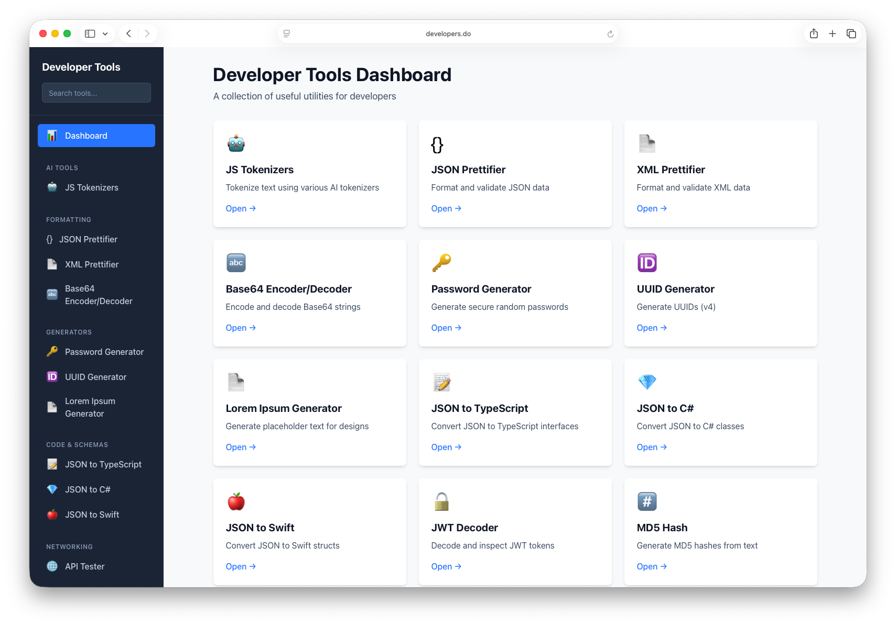

<p align="center">
  
</p>

# DevTools

A collection of essential developer tools built with privacy in mind.
No backend. Tool data never leaves your browser. Anonymized analytics help improve the site.



## Tools

### AI Tools
*   **JS Tokenizers:** Tokenize text using various AI tokenizers
*   **RAG Chunker:** Split text into retrieval-friendly chunks with overlap and token counts
*   **Text Extractor:** Extract emails, URLs, IPs, dates, and patterns from text
*   **Sentiment Analysis:** Analyze emotional tone of text using AI
*   **Zero-Shot Classification:** Classify text into custom categories without training using AI
*   **Sentence Similarity:** Generate embeddings and find semantic similarity between texts using AI
*   **Question Answering:** Answer questions based on provided context using AI
*   **Fill-Mask Text Completion:** Complete sentences and predict missing words using AI
*   **Text Summarization:** Summarize long text into concise overviews using AI

### Formatting
*   **JSON Prettifier:** Format and validate JSON data
*   **XML Prettifier:** Format and validate XML data
*   **HL7 Parser:** Read and parse HL7 v2 messages into structured JSON
*   **HL7 to FHIR Converter:** Convert HL7 v2 messages to FHIR R4 Bundles
*   **Diff / Text Compare:** Compare two texts and see color-coded differences
*   **Stacktrace Formatter:** Format and beautify stack traces from multiple programming languages
*   **Beautify Stack Trace:** Clean up and beautify messy error stack traces for readability
*   **Stack Trace Analyzer:** Analyze stack traces to identify root causes, explain errors, and separate app from framework code
*   **Base64 Encoder/Decoder:** Encode and decode Base64 strings
*   **File Size Converter:** Convert file sizes between decimal (SI) and binary (IEC) units
*   **Unix Timestamp Converter:** Convert between Unix epoch timestamps and human-readable dates with timezone support
*   **Cron Expression Tester:** Test and parse cron expressions, explain them in plain English, and preview upcoming run times across timezones
*   **Cron Expression Generator:** Build cron expressions visually with field controls — no syntax knowledge required
*   **URL Encoder / Decoder:** Encode and decode URLs using encodeURIComponent and encodeURI
*   **YAML ↔ JSON Converter:** Convert between YAML and JSON with auto-detection of input format
*   **SQL Formatter:** Format and prettify SQL queries with support for MySQL, PostgreSQL, SQLite, and more

### Algorithms
*   **String Similarity:** Compare strings using Jaro-Winkler, Levenshtein, Dice, and Hamming algorithms
*   **Regex Tester:** Test regular expressions with match highlighting, capture groups, and string replacement
*   **Regex Library:** Browse and copy common regular expressions for validation, extraction, and text processing
*   **Number Base Converter:** Convert numbers between binary, octal, decimal, and hex with two's complement

### Generators
*   **Password Generator:** Generate secure random passwords
*   **UUID Generator:** Generate UUIDs (v4)
*   **Lorem Ipsum Generator:** Generate placeholder text for designs
*   **Random Number Generator:** Generate random numbers and see code samples in multiple languages
*   **QR Code Generator:** Generate QR codes from text, URLs, or any data

### Code & Schemas
*   **JSON to TypeScript:** Convert JSON to TypeScript interfaces
*   **JSON to JSDoc:** Convert JSON to JSDoc type definitions
*   **JSON to C#:** Convert JSON to C# classes
*   **JSON to Swift:** Convert JSON to Swift structs
*   **JSON to Kotlin:** Convert JSON to Kotlin data classes
*   **JSON to Python:** Convert JSON to Python dataclasses or Pydantic models
*   **JSON to Go:** Convert JSON to Go structs
*   **JSON to Rust:** Convert JSON to Rust structs
*   **Color Picker:** Pick colors and convert between HEX, RGB, HSL, HSV, and CMYK formats

### Security
*   **Secrets Scanner:** Scan text, logs, or configs for leaked keys and tokens
*   **JWT Decoder:** Decode and inspect JWT tokens
*   **MD5 Hash:** Generate MD5 hashes from text
*   **SHA-1 Hash:** Generate SHA-1 hashes from text
*   **SHA-256/512 Hash:** Generate secure SHA-256 or SHA-512 hashes from text
*   **Clawdbot Security Scanner:** Audit Clawdbot/Moltbot/OpenClaw configs for security vulnerabilities
*   **SAML Decoder:** Decode SAML Requests/Responses from Base64 to readable XML
*   **SAML Metadata Parser:** Parse SAML Metadata XML and extract IdP/SP configuration
*   **SAML Certificate Inspector:** Inspect X.509 certificates from SAML metadata, responses, or PEM
*   **CSR Decoder:** Decode PKCS#10 CSRs and inspect subjects, SANs, extensions, and key details
*   **SAML Assertion Builder:** Generate test SAML Responses, AuthnRequests, and LogoutRequests

### Networking
*   **API Tester:** Test and view API responses
*   **HTTP Status Code Reference:** Searchable reference of all HTTP status codes with descriptions and use cases

### Data
*   **OSS Data:** Open-source data tools for developers

### Apps
*   **iOS App Lookup:** Look up iOS app metadata from the App Store using bundle ID
*   **Terremoto:** iOS app for tracking earthquakes in real-time
*   **FedPulse:** iOS app to search, save, and track federal government jobs
*   **FAA Part 107 Quiz Prep:** iOS app for FAA Part 107 drone pilot certification exam preparation
*   **Citizenship Test Prep:** iOS app for US citizenship naturalization test preparation
*   **ClawPet:** iOS virtual desktop pet that visualizes bot activity in real-time

## View Live

Explore the live version of this DevTools suite at [https://www.developers.do](https://www.developers.do).

## AI Discoverability

This site supports the [llms.txt](https://llmstxt.org/) standard for AI discoverability:

- [`/llms.txt`](https://developers.do/llms.txt) - Concise overview of all tools
- [`/llms-full.txt`](https://developers.do/llms-full.txt) - Detailed documentation for AI consumption

## Prerequisites

Ensure you have the following installed on your system:

*   **Git:** For cloning the repository.
*   **Bun:** The JavaScript runtime and package manager.

## Getting Started

Follow these steps to get the application up and running on your local machine.

### 1. Clone the Repository

```bash
git clone https://github.com/hminaya/devtools/devtools.git
cd devtools
```

### 2. Install Dependencies

```bash
bun install
```

### 3. Run the Application

```bash
bun run dev
```

The application will typically be accessible at `http://localhost:3000` in your web browser.

### Customizing the Port

By default, the application runs on port `3000`. To customize it, copy the example environment file:

```bash
cp .env.local.example .env.local
```

Then, you can edit the `PORT` variable inside your new `.env.local` file. This file is ignored by Git, so your local settings won't be committed.


## Available Scripts

In the project directory, you can run:

*   `bun run dev`: Runs the app in development mode.
*   `bun run build`: Builds the application for production.
*   `bun run start`: Starts the production server (after building).

## Docker

You can build and run the app locally using Docker — no Bun or Node.js installation required.

### Build the image

```bash
docker build -t developers-do .
```

### Run the container

```bash
docker run -p 8080:80 developers-do
```

The app will be available at `http://localhost:8080`.

### How it works

The Docker build uses a two-stage process:

1. **Builder** — installs dependencies with Bun and runs `bun run build`, producing static HTML/CSS/JS in the `out/` directory.
2. **Runner** — copies the static files into an nginx image for serving. No Node.js or Bun is needed at runtime.

## License

This project is licensed under the [Creative Commons Attribution-NonCommercial-ShareAlike 4.0 International License](LICENSE).
